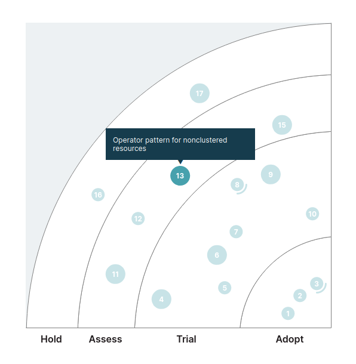

# Operator pattern for nonclustered resources

---

<!-- _class: lead-invert-purple -->

### Tech radar

Section: **Techniques**

Verdict: **Assess**



---

## Controllers in Kubernetes

<!-- _class: lead-invert-purple -->

You tell Kubernetes what you want, and a controller makes it happen. ✨

So you give the Kubernetes API this yaml:

```yaml
apiVersion: v1
kind: Pod
metadata:
  name: my-website
spec:
  containers:
    - name: web-server
      image: nginx:latest
```

And a Pod Controller creates a Pod for you.

---

## an operator == a custom controller

---

<!-- _class: lead-invert-purple -->

An example: **wordpress-operator**

###### `github.com/bitpoke/wordpress-operator`

<br>

Instead of a `Pod`, you can create a `Wordpress` object:

```yaml
apiVersion: wordpress.presslabs.org/v1alpha1
kind: Wordpress
metadata:
  name: mysite
spec:
  replicas: 3
  domains:
    - example.com
  code:
    git:
      repository: https://github.com/example
```

And the Wordpress Operator makes it happen.

---

<!-- _class: default -->

The Wordpress Operator creates things like: 

- Deployments
- Pods
- ConfigMaps
- Services
- PersistentVolumeClaims

<br>
<br>
<br>

#### ☝ All normal cluster resources

---


But what if you could create things outside of the Kubernetes cluster? 🤔

---

<!-- _class: lead-invert-purple -->

### Ordering pizza

#### `github.com/rudoi/cruster-api`

```yaml
apiVersion: alpha.rudeboy.io/v1
kind: PizzaOrder
metadata:
  name: my-order
spec:
  pizzas:
    - size: large
      toppings:
        - pepperoni
    - size: large
      toppings:
        - pepperoni
        - sausage
```

---

<!-- _class: lead-invert-purple -->

A more normal example: 

**ACK** (AWS Controllers for Kubernetes)

<br>
You can create a S3 bucket:

```yaml
apiVersion: s3.services.k8s.aws/v1alpha1
kind: Bucket
metadata:
  name: cat-pictures
spec:
  name: cat-pictures
```

---

<!-- _class: default -->

# Pros:

- You can version your infrastructure along with your code.

# Cons / things to be aware of:

- Need to be able to trust the pull request process.
  - The CI/CD job to deploy the app to Kubernetes now has the power to create and destroy databases / instances / buckets.
- You can't make AWS / Azure / GCP permissions very specific.
  - People with commit access to the repo will be able to 

---

<!-- _class: lead-invert-purple -->

My verdict: Trial

It really just depends on the quality of the operator. Love the concept though.

---


<!-- _class: lead-invert-purple -->

### Source:

### `github.com/dbirks/techradar`

<br>

### Brought to you by:

A markdown-to-slides tool called Marp:

### `github.com/marp-team/marp`

And a Marp theme named **`colors`**, from:

### `github.com/matsubara0507/marp-themes`
