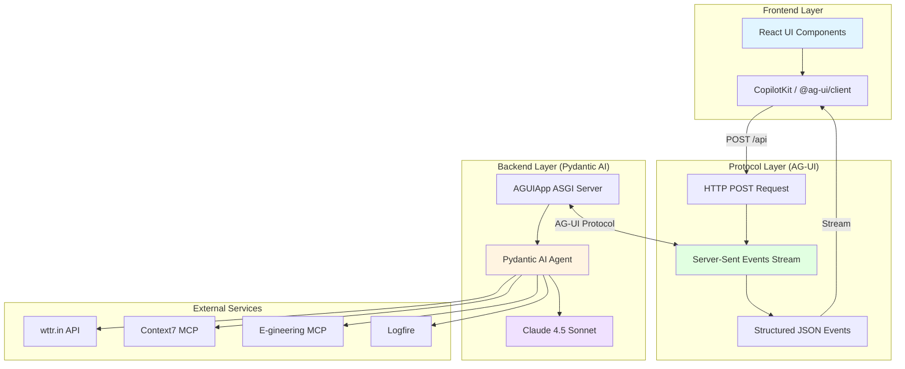
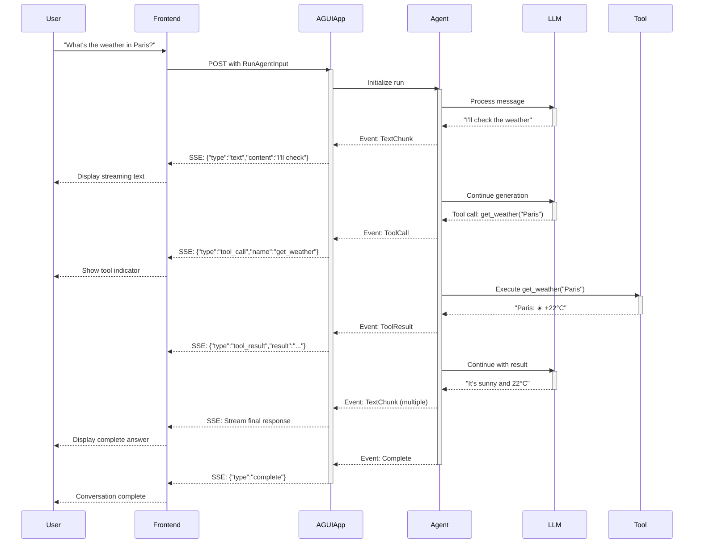
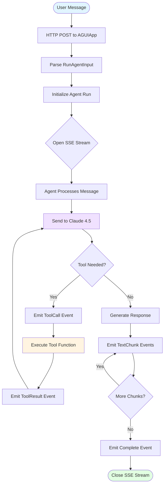
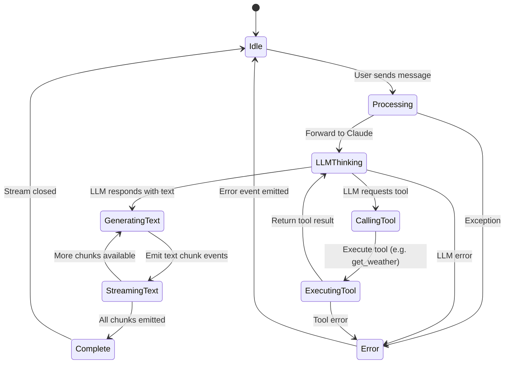

# AG-UI Protocol & assistant-ui

## AG-UI Protocol

Tech radar: https://www.thoughtworks.com/en-us/radar/platforms/ag-ui-protocol

Github: https://github.com/ag-ui-protocol/ag-ui

**Assessment:** Assess (November 2025)

An open-source protocol standardizing communication between AI agents and user interfaces. Enables real-time collaboration between backend agents and frontend applications through middleware and client integrations.

## assistant-ui

Tech radar: https://www.thoughtworks.com/en-us/radar/languages-and-frameworks/assistant-ui

Github: https://github.com/assistant-ui/assistant-ui

**Assessment:** Assess (November 2025)

An open-source TypeScript and React library for AI chat interfaces. Handles complex parts of chat UI implementation (streaming, state management, message editing, branch switching) while allowing developers to design custom components using Radix primitives.

## Notes

- Both technologies are part of the rapid evolution of AI assistance highlighted in the November 2025 Tech Radar
- AG-UI Protocol works with frameworks like LangGraph and Pydantic AI
- assistant-ui integrates with Vercel AI SDK and LangGraph

## How They Combine

While AG-UI Protocol and assistant-ui are **separate projects**, they address complementary layers of the agent UI stack:

### AG-UI Protocol (Communication Layer)
- Standardizes backend-to-frontend communication for AI agents
- Event-based protocol for streaming agent states, tool calls, and messages
- Core packages: `@ag-ui/core`, `@ag-ui/client`, `@ag-ui/mastra`
- Primary React client: **CopilotKit** (`@copilotkit/react-core`, `@copilotkit/react-ui`)

### assistant-ui (UI Component Layer)
- Provides composable React components for chat interfaces
- Handles streaming, state management, message editing, and branch switching
- Main package: `@assistant-ui/react`
- Works with multiple backends: AI SDK, LangGraph, Mastra, custom backends

### Potential Integration
While there's no official `@ag-ui/assistant-ui` integration package yet, these projects could theoretically work together:
- **AG-UI Protocol** as the communication protocol between agent backend and frontend
- **assistant-ui** as the UI component library for rendering the chat interface
- Both support overlapping frameworks (LangGraph, Mastra) suggesting architectural compatibility

Currently, the recommended production stack for AG-UI is **CopilotKit**, which provides a complete React UI solution built on the AG-UI protocol.

---

## Implementation Architecture

This repository includes a complete working implementation of AG-UI with Pydantic AI, demonstrating the protocol in action.

### Tech Stack

- **Backend:** Pydantic AI + Uvicorn (ASGI)
- **Protocol:** AG-UI (Server-Sent Events)
- **LLM:** Anthropic Claude 4.5
- **Tools:** wttr.in Weather, Context7 MCP, E-gineering MCP
- **Frontend:** CopilotKit / @ag-ui/client
- **Observability:** Logfire

### System Architecture



### AG-UI Protocol Flow

The AG-UI protocol enables real-time streaming of agent responses, tool calls, and state updates:



### Event Types

AG-UI streams these structured events over SSE:

| Event Type | Description | Payload Example |
|------------|-------------|-----------------|
| `text` | Streaming text chunks from LLM | `{"type":"text","content":"Hello"}` |
| `tool_call` | Agent invoking a tool | `{"type":"tool_call","name":"get_weather","args":{...}}` |
| `tool_result` | Tool execution completed | `{"type":"tool_result","result":"22°C"}` |
| `state_update` | Agent state changed | `{"type":"state_update","state":{...}}` |
| `complete` | Stream finished | `{"type":"complete"}` |
| `error` | Error occurred | `{"type":"error","message":"..."}` |

### Message Flow Diagram



### State Management



## Quick Start

### 1. Run the Backend

```bash
cd demo/api

# Configure environment
cp .env.example .env
# Edit .env and add ANTHROPIC_API_KEY

# Run with uv (PEP 723)
uv run agent.py
```

Server starts at `http://localhost:8000`

### 2. Test with curl

```bash
curl -N -X POST http://localhost:8000 \
  -H "Content-Type: application/json" \
  -d '{
    "messages": [
      {"role": "user", "content": "What'\''s the weather in Tokyo?"}
    ]
  }'
```

You'll see SSE events streaming back:

```
data: {"type":"text","content":"Let"}
data: {"type":"text","content":" me"}
data: {"type":"text","content":" check"}
data: {"type":"tool_call","name":"get_weather","args":{"location":"Tokyo"}}
data: {"type":"tool_result","result":"Tokyo: ⛅ +15°C"}
data: {"type":"text","content":"It's"}
data: {"type":"text","content":" currently"}
...
data: {"type":"complete"}
```

### 3. Build a Frontend

#### Option A: CopilotKit (Recommended)

```bash
npx create-react-app my-agent-ui --template typescript
cd my-agent-ui
npm install @copilotkit/react-core @copilotkit/react-ui
```

**App.tsx:**

```tsx
import { CopilotKit } from "@copilotkit/react-core";
import { CopilotChat } from "@copilotkit/react-ui";
import "@copilotkit/react-ui/styles.css";

function App() {
  return (
    <CopilotKit runtimeUrl="http://localhost:8000">
      <div style={{ height: "100vh" }}>
        <CopilotChat
          labels={{
            title: "AI Assistant",
            initial: "Hello! Ask me about weather or code documentation.",
          }}
        />
      </div>
    </CopilotKit>
  );
}

export default App;
```

#### Option B: @ag-ui/client (Lower Level)

```typescript
import { HttpAgent } from "@ag-ui/client";

const agent = new HttpAgent({ url: "http://localhost:8000" });

const stream = await agent.run({
  messages: [{ role: "user", content: "What's the weather?" }]
});

for await (const event of stream) {
  console.log("Event:", event);
}
```

#### Option C: assistant-ui (Custom UI)

```bash
npm install @assistant-ui/react
```

Create a custom runtime adapter for AG-UI protocol and use assistant-ui components for rendering.

## Tools & Features

### Built-in Tools

1. **Weather Tool** - Real-time weather via wttr.in
   ```
   User: What's the weather in Paris?
   Agent: [Calls get_weather("Paris")]
   Result: "Paris: ☀️ +22°C"
   ```

2. **Context7 MCP** - Up-to-date code documentation (FREE)
   ```
   User: How do React hooks work?
   Agent: [Calls context7 MCP server]
   Result: Latest React documentation
   ```

3. **E-gineering MCP** - Additional capabilities (OAuth protected)
   ```
   Requires: MCP_OAUTH_TOKEN in .env
   ```

### Adding Custom Tools

Edit `demo/api/agent.py`:

```python
@agent.tool_plain
async def my_tool(param: str) -> str:
    """Tool description for LLM."""
    # Your logic here
    return "result"
```

### Adding MCP Servers

```python
MCPServerTool(
    id="my_server",
    url="https://my-mcp.example.com/mcp",
    authorization_token=os.getenv("MCP_TOKEN"),
    allowed_tools=["*"],
    description="My custom MCP server"
)
```

## Technology Comparison

### Why AG-UI Protocol?

| Feature | AG-UI | REST API | WebSocket |
|---------|-------|----------|-----------|
| Streaming | ✅ Native SSE | ❌ Limited | ✅ Yes |
| Structured Events | ✅ Built-in | ⚠️ Custom | ⚠️ Custom |
| Tool Call Visibility | ✅ Real-time | ❌ No | ⚠️ Manual |
| State Synchronization | ✅ Automatic | ❌ Manual | ⚠️ Manual |
| Frontend Libraries | ✅ CopilotKit | ❌ None | ❌ None |
| HTTP/2 Support | ✅ Yes | ✅ Yes | ❌ No |
| Bidirectional | ⚠️ No | ❌ No | ✅ Yes |

### Why Pydantic AI?

- ✅ **Type Safety**: Full Pydantic validation
- ✅ **AG-UI Native**: Built-in `AGUIApp` adapter
- ✅ **MCP Support**: Native `MCPServerTool`
- ✅ **Multi-Model**: Anthropic, OpenAI, Gemini, etc.
- ✅ **Observability**: Logfire integration
- ✅ **Async**: Full async/await support

### Why PEP 723?

```python
# /// script
# dependencies = ["pydantic-ai[anthropic]>=0.0.1"]
# ///
```

- ✅ Single-file scripts with dependencies
- ✅ Run with `uv run script.py`
- ✅ No separate requirements.txt
- ✅ Easy sharing and reproducibility

## Project Structure

```
ag-ui/
├── README.md                    # This file (architecture & guide)
├── demo/
│   └── api/
│       ├── agent.py            # PEP 723 agent script
│       ├── .env                # Environment config
│       ├── .env.example        # Example config
│       └── README.md           # API documentation
└── instructions/
    └── 01_deep_research.md     # Implementation guide
```

## Resources

### Official Documentation
- [AG-UI Protocol](https://github.com/ag-ui-protocol/ag-ui)
- [Pydantic AI](https://ai.pydantic.dev/)
- [CopilotKit](https://www.copilotkit.ai/)
- [assistant-ui](https://github.com/assistant-ui/assistant-ui)

### Related Projects
- [Context7 MCP Server](https://github.com/upstash/context7)
- [Logfire Observability](https://logfire.pydantic.dev/)
- [Anthropic Claude](https://www.anthropic.com/)

### Tech Radar
- [AG-UI Protocol - ThoughtWorks](https://www.thoughtworks.com/en-us/radar/platforms/ag-ui-protocol)
- [assistant-ui - ThoughtWorks](https://www.thoughtworks.com/en-us/radar/languages-and-frameworks/assistant-ui)
