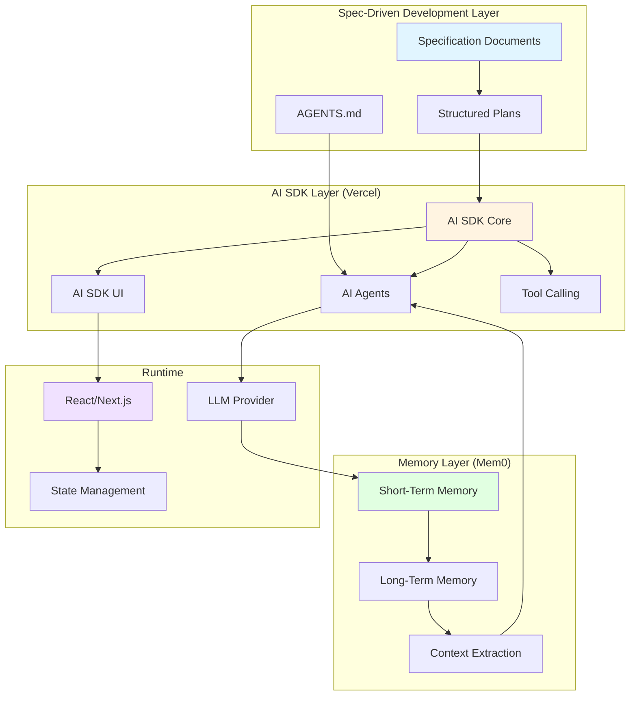
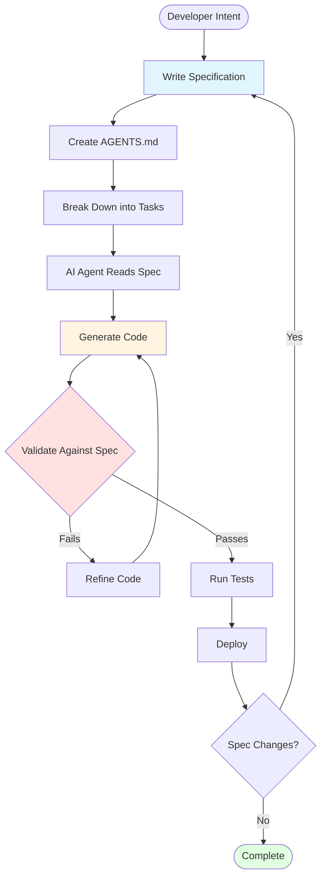

# Vercel AI SDK + Mem0 + Spec-Driven Development


## Vercel AI SDK

Tech radar: https://www.thoughtworks.com/en-us/radar/languages-and-frameworks/vercel-ai-sdk

Docs: https://ai-sdk.dev/docs/introduction

Github: https://github.com/vercel/ai

An open-source, full-stack toolkit for building AI-powered applications and agents in the TypeScript ecosystem. Consists of AI SDK Core (model-agnostic LLM calls) and AI SDK UI (streaming, state management, real-time updates for React, Vue, Next.js, Svelte).

## Mem0

Tech radar: https://www.thoughtworks.com/en-us/radar/languages-and-frameworks/mem0

Docs: https://mem0.ai/

Github: https://github.com/mem0ai/mem0

Universal memory layer for AI agents. Replaces naive full-context approaches with intelligent short-term recall and long-term memory that extracts and stores only salient facts and relationships. Delivers +26% accuracy over OpenAI Memory, 91% faster responses, and 90% lower token usage.

## Spec-Driven Development

Tech radar: https://www.thoughtworks.com/en-us/radar/techniques/spec-driven-development

Blog: https://www.thoughtworks.com/en-us/insights/blog/agile-engineering-practices/spec-driven-development-unpacking-2025-new-engineering-practices

A development paradigm that uses well-crafted software requirement specifications as prompts for AI coding agents to generate executable code. Replaces ad hoc "vibe coding" with structured, durable specifications as the source of truth.

## Why These Technologies Work Together



### The Synergy

1. **Spec-Driven Development** provides the structured foundation - clear requirements and intentions that guide AI agents
2. **Vercel AI SDK** offers the TypeScript-native implementation layer - streaming, tool calling, and UI components
3. **Mem0** adds intelligent persistence - remembering user preferences, facts, and context across sessions

This combination addresses the complete lifecycle of AI applications:
- **Planning:** Structured specifications replace vibe coding
- **Execution:** Type-safe SDK with streaming and tool support
- **Memory:** Intelligent context management across conversations

## Vercel AI SDK Deep Dive

### Core Features

#### AI SDK Core
```typescript
import { generateText, streamText, generateObject } from 'ai';
import { anthropic } from '@ai-sdk/anthropic';

// Simple text generation
const { text } = await generateText({
  model: anthropic('claude-sonnet-4-5'),
  prompt: 'What is TypeScript?'
});

// Streaming text
const result = streamText({
  model: anthropic('claude-sonnet-4-5'),
  prompt: 'Write a story about AI',
});

for await (const textPart of result.textStream) {
  process.stdout.write(textPart);
}

// Structured output
const { object } = await generateObject({
  model: anthropic('claude-sonnet-4-5'),
  schema: z.object({
    name: z.string(),
    age: z.number(),
  }),
  prompt: 'Extract person info: John is 30 years old'
});
```

#### AI SDK UI (React)
```tsx
import { useChat } from 'ai/react';

export default function Chat() {
  const { messages, input, handleInputChange, handleSubmit } = useChat();

  return (
    <div>
      {messages.map(m => (
        <div key={m.id}>
          {m.role}: {m.content}
        </div>
      ))}

      <form onSubmit={handleSubmit}>
        <input value={input} onChange={handleInputChange} />
      </form>
    </div>
  );
}
```

### Tool Calling
```typescript
import { generateText, tool } from 'ai';
import { z } from 'zod';

const result = await generateText({
  model: anthropic('claude-sonnet-4-5'),
  tools: {
    weather: tool({
      description: 'Get the weather in a location',
      parameters: z.object({
        location: z.string().describe('The location to get weather for'),
      }),
      execute: async ({ location }) => ({
        temperature: 72,
        condition: 'sunny',
      }),
    }),
  },
  prompt: 'What is the weather in San Francisco?',
});
```

### Supported Providers
- Anthropic (Claude)
- OpenAI (GPT-4, GPT-3.5)
- Google (Gemini)
- Mistral
- Cohere
- And many more...

## Mem0 Deep Dive

### Core Concepts

Mem0 acts as an intelligent memory layer that sits between your application and the LLM, automatically:
- Extracting important facts from conversations
- Storing them efficiently in long-term memory
- Retrieving relevant context for future interactions
- Adapting to user preferences over time

### Installation
```bash
pip install mem0ai
# or
npm install mem0ai
```

### Basic Usage (Python)
```python
from mem0 import Memory

# Initialize memory
m = Memory()

# Add memories from conversations
m.add("I like to have coffee in the morning", user_id="alice")
m.add("I prefer dark roast", user_id="alice")

# Search relevant memories
related_memories = m.search(
    query="What does Alice like?",
    user_id="alice"
)
# Returns: ['Likes coffee in the morning', 'Prefers dark roast']

# Get all memories for a user
all_memories = m.get_all(user_id="alice")

# Update memory
m.update(memory_id="mem_123", data="I prefer light roast now")

# Delete specific memory
m.delete(memory_id="mem_123")
```

### Integration with AI SDK
```typescript
import { Memory } from 'mem0ai';
import { generateText } from 'ai';
import { anthropic } from '@ai-sdk/anthropic';

const memory = new Memory();

async function chatWithMemory(userId: string, message: string) {
  // Retrieve relevant memories
  const memories = await memory.search({
    query: message,
    user_id: userId,
  });

  // Build context from memories
  const context = memories.map(m => m.memory).join('\n');

  // Generate response with context
  const { text } = await generateText({
    model: anthropic('claude-sonnet-4-5'),
    prompt: `
Context about the user:
${context}

User message: ${message}

Respond naturally, taking into account what you know about the user.
    `,
  });

  // Store new facts from this conversation
  await memory.add(message, { user_id: userId });
  await memory.add(text, { user_id: userId });

  return text;
}
```

### Memory Types

| Type | Description | Use Case |
|------|-------------|----------|
| User Memory | Per-user preferences and facts | Personalization |
| Session Memory | Temporary conversation context | Single conversation |
| Agent Memory | Agent-specific learned behaviors | Agent improvement |
| System Memory | Global facts and rules | System-wide knowledge |

### Architecture Benefits

**Traditional Approach (Full Context):**
- Every conversation resends entire history
- Token costs scale linearly
- Slower responses
- Context window limits

**Mem0 Approach:**
- Only salient facts stored
- 90% lower token usage
- 91% faster responses
- Unlimited conversation history

## Spec-Driven Development Deep Dive

### What is SDD?

Spec-driven development (SDD) shifts from:
- ❌ Ad hoc prompts and "vibe coding"
- ❌ Code first, docs later
- ❌ Agents going haywire

To:
- ✅ Structured specifications as source of truth
- ✅ Specs first, code generated from them
- ✅ Clear constraints and validation

### Core Workflow



### Key Techniques

#### 1. AGENTS.md Files
```markdown
# Project: Weather App

## Overview
Build a weather application with real-time forecasts.

## Architecture
- Frontend: Next.js + Vercel AI SDK
- Backend: API routes with tool calling
- Memory: Mem0 for user preferences
- LLM: Claude Sonnet 4.5

## Constraints
- Must work offline with cached data
- Response time < 2s
- Mobile-first design

## Success Criteria
- [ ] Shows current weather
- [ ] 7-day forecast
- [ ] Remembers user's favorite locations
- [ ] Accessible (WCAG 2.1 AA)
```

#### 2. Specification Files
```yaml
# spec.yaml
service: weather-app
version: 1.0.0

endpoints:
  - path: /api/weather
    method: POST
    input:
      location: string (required)
      units: enum[celsius, fahrenheit] (optional, default: celsius)
    output:
      temperature: number
      condition: string
      forecast: array<DailyForecast>

  - path: /api/preferences
    method: GET
    input:
      userId: string (required)
    output:
      favoriteLocations: array<string>
      preferredUnits: string

types:
  DailyForecast:
    date: string (ISO 8601)
    high: number
    low: number
    condition: string
    precipitation: number
```

#### 3. GitHub Spec Kit
```bash
# Install Spec Kit
npm install -g @github/spec-kit

# Initialize project with spec
spec-kit init

# Generate code from spec
spec-kit generate --spec spec.yaml --output src/

# Validate implementation
spec-kit validate --spec spec.yaml --code src/
```

### Tools & Frameworks

| Tool | Purpose | Link |
|------|---------|------|
| GitHub Spec Kit | Open-source SDD toolkit | https://github.com/github/spec-kit |
| Agent OS | Free SDD framework | https://buildermethods.com/agent-os |
| Tessl Framework | Spec-as-artifact (beta) | https://tessl.io |
| Kiro | AI spec-driven platform | https://kiro.dev |

### ThoughtWorks Cautions

⚠️ **Risks to Watch:**
- Reverting to waterfall with "big design up front"
- Big-bang releases instead of incremental delivery
- Over-specification reducing flexibility
- Specs becoming out of sync with code

✅ **Best Practices:**
- Keep specs focused and granular
- Use specs as single source of truth for incremental delivery
- Validate frequently
- Update specs alongside code changes

## Combining All Three: Complete Example

### Project Structure
```
weather-app/
├── AGENTS.md                  # Spec-driven development guide
├── spec.yaml                  # API specification
├── src/
│   ├── app/
│   │   ├── page.tsx          # Next.js + AI SDK UI
│   │   └── api/
│   │       ├── chat/
│   │       │   └── route.ts  # AI SDK Core endpoint
│   │       └── weather/
│   │           └── route.ts  # Weather tool
│   ├── lib/
│   │   ├── memory.ts         # Mem0 integration
│   │   └── ai.ts             # AI SDK config
│   └── tools/
│       └── weather.ts        # Weather tool implementation
└── package.json
```

### Implementation

#### 1. AGENTS.md (Spec-Driven Development)
```markdown
# Weather Assistant Specification

## Purpose
Build an AI weather assistant that remembers user preferences and provides personalized forecasts.

## Requirements
1. Natural language weather queries
2. Remember favorite locations per user
3. Remember preferred temperature units
4. Real-time streaming responses
5. Tool calling for weather API

## Stack
- Vercel AI SDK (streaming + tools)
- Mem0 (user preferences)
- Next.js 15 (App Router)
- Anthropic Claude Sonnet 4.5

## Success Criteria
- Response time < 3s
- Remembers preferences across sessions
- Handles multi-turn conversations
- Mobile responsive
```

#### 2. Memory Integration (`src/lib/memory.ts`)
```typescript
import { Memory } from 'mem0ai';

const memory = new Memory({
  apiKey: process.env.MEM0_API_KEY,
});

export async function getUserPreferences(userId: string) {
  const memories = await memory.search({
    query: 'user preferences locations units',
    user_id: userId,
  });

  return {
    favoriteLocations: memories
      .filter(m => m.memory.includes('favorite location'))
      .map(m => m.memory),
    preferredUnits: memories
      .find(m => m.memory.includes('prefers'))
      ?.memory || 'celsius',
  };
}

export async function saveConversation(
  userId: string,
  message: string,
  response: string
) {
  await memory.add(message, { user_id: userId, role: 'user' });
  await memory.add(response, { user_id: userId, role: 'assistant' });
}
```

#### 3. AI SDK Route (`src/app/api/chat/route.ts`)
```typescript
import { anthropic } from '@ai-sdk/anthropic';
import { streamText, tool } from 'ai';
import { z } from 'zod';
import { getUserPreferences, saveConversation } from '@/lib/memory';

export async function POST(req: Request) {
  const { messages, userId } = await req.json();

  // Get user preferences from Mem0
  const prefs = await getUserPreferences(userId);

  // Create weather tool
  const weatherTool = tool({
    description: 'Get weather for a location',
    parameters: z.object({
      location: z.string(),
      units: z.enum(['celsius', 'fahrenheit']).optional(),
    }),
    execute: async ({ location, units = prefs.preferredUnits }) => {
      const response = await fetch(
        `https://wttr.in/${location}?format=j1&${units === 'fahrenheit' ? 'u' : 'm'}`
      );
      const data = await response.json();

      return {
        temperature: data.current_condition[0].temp_C,
        condition: data.current_condition[0].weatherDesc[0].value,
        location,
      };
    },
  });

  // Stream response with AI SDK
  const result = streamText({
    model: anthropic('claude-sonnet-4-5'),
    messages,
    tools: {
      getWeather: weatherTool,
    },
    system: `You are a helpful weather assistant.

User preferences:
${prefs.favoriteLocations.length > 0 ? `- Favorite locations: ${prefs.favoriteLocations.join(', ')}` : ''}
- Preferred units: ${prefs.preferredUnits}

Use these preferences to provide personalized responses.`,
  });

  // Save conversation to Mem0 after streaming
  result.then(async (stream) => {
    const lastMessage = messages[messages.length - 1].content;
    const responseText = await stream.text;
    await saveConversation(userId, lastMessage, responseText);
  });

  return result.toDataStreamResponse();
}
```

#### 4. UI Component (`src/app/page.tsx`)
```typescript
'use client';

import { useChat } from 'ai/react';

export default function WeatherChat() {
  const { messages, input, handleInputChange, handleSubmit, isLoading } = useChat({
    api: '/api/chat',
    body: {
      userId: 'user-123', // In production, get from auth
    },
  });

  return (
    <div className="flex flex-col h-screen max-w-2xl mx-auto p-4">
      <div className="flex-1 overflow-y-auto space-y-4">
        {messages.map(message => (
          <div
            key={message.id}
            className={`p-4 rounded-lg ${
              message.role === 'user'
                ? 'bg-blue-100 ml-auto'
                : 'bg-gray-100'
            } max-w-[80%]`}
          >
            <div className="font-semibold mb-1">
              {message.role === 'user' ? 'You' : 'Assistant'}
            </div>
            <div>{message.content}</div>

            {/* Show tool calls */}
            {message.toolInvocations?.map(tool => (
              <div key={tool.toolCallId} className="mt-2 text-sm text-gray-600">
                🔧 Calling {tool.toolName}...
                {tool.state === 'result' && (
                  <div className="mt-1 font-mono text-xs">
                    {JSON.stringify(tool.result, null, 2)}
                  </div>
                )}
              </div>
            ))}
          </div>
        ))}

        {isLoading && (
          <div className="bg-gray-100 p-4 rounded-lg">
            <div className="animate-pulse">Thinking...</div>
          </div>
        )}
      </div>

      <form onSubmit={handleSubmit} className="mt-4 flex gap-2">
        <input
          value={input}
          onChange={handleInputChange}
          placeholder="Ask about the weather..."
          className="flex-1 p-3 border rounded-lg"
        />
        <button
          type="submit"
          disabled={isLoading}
          className="px-6 py-3 bg-blue-500 text-white rounded-lg disabled:opacity-50"
        >
          Send
        </button>
      </form>
    </div>
  );
}
```

### Example Interaction

```
User: What's the weather in Tokyo?
Assistant: 🔧 Calling getWeather(location="Tokyo")...

[Returns: {temperature: 15, condition: "Partly cloudy", location: "Tokyo"}]

Assistant: Currently in Tokyo, it's partly cloudy with a temperature of 15°C.

User: Great\! Save Tokyo as one of my favorite locations and use Celsius

Assistant: [Mem0 stores: "Favorite location: Tokyo", "Prefers celsius"]

I've saved Tokyo as one of your favorite locations and noted your preference for Celsius\!

// Later conversation...

User: How's the weather?

Assistant: [Retrieves from Mem0: "Favorite location: Tokyo", "Prefers celsius"]

I'll check the weather in Tokyo for you.

🔧 Calling getWeather(location="Tokyo", units="celsius")...

[Mem0 remembered the user's preferences without being told\!]
```

### How It Works

1. **Spec Defines Structure** - AGENTS.md specifies the weather assistant requirements
2. **AI SDK Handles Execution** - Streaming, tool calling, and UI rendering
3. **Mem0 Adds Memory** - User preferences persist across sessions
4. **Result**: Personalized, streaming AI assistant with memory

## Comparison: With vs Without This Stack

| Aspect | Without Stack | With Vercel AI SDK + Mem0 + SDD |
|--------|--------------|----------------------------------|
| **Planning** | Ad hoc prompting | Structured AGENTS.md specification |
| **Streaming** | Manual SSE implementation | Built-in `useChat` hook |
| **Type Safety** | Any/unknown types | Full TypeScript with Zod schemas |
| **Tool Calling** | Custom function parsing | Native `tool()` definition |
| **Memory** | Full context every time | Intelligent fact extraction |
| **Token Usage** | High (full history) | 90% reduction (salient facts only) |
| **Response Time** | Slow (large context) | 91% faster (minimal context) |
| **Personalization** | Manual context injection | Automatic preference recall |
| **UI State** | Manual state management | Built-in `useChat` state |
| **Multi-Provider** | Rewrite for each LLM | Unified API across providers |

## Getting Started

### Quick Start Template

```bash
# Create Next.js app
npx create-next-app@latest my-ai-app --typescript --tailwind --app

cd my-ai-app

# Install dependencies
npm install ai @ai-sdk/anthropic mem0ai zod

# Setup environment
echo "ANTHROPIC_API_KEY=your-key-here" > .env.local
echo "MEM0_API_KEY=your-key-here" >> .env.local
```

### Project Structure
```
my-ai-app/
├── AGENTS.md                          # Your specification
├── src/
│   ├── app/
│   │   ├── page.tsx                   # Chat UI
│   │   └── api/
│   │       └── chat/
│   │           └── route.ts           # AI SDK endpoint
│   └── lib/
│       └── memory.ts                  # Mem0 integration
└── .env.local                         # API keys
```

### Next Steps

1. **Write AGENTS.md** - Define your application requirements
2. **Create memory.ts** - Set up Mem0 integration
3. **Build API route** - Implement AI SDK endpoint with tools
4. **Design UI** - Use AI SDK UI hooks for seamless streaming
5. **Iterate** - Update specs as requirements evolve

## Related Technologies

### Complementary Tools

- **LangChain** - More complex agent orchestration (Python/TS)
- **AutoGen** - Multi-agent conversations (Microsoft)
- **CrewAI** - Role-based agent teams (Python)
- **AG-UI Protocol** - Backend-to-frontend agent communication (see ../ag-ui/)
- **assistant-ui** - React UI components for AI chat (see ../ag-ui/)
- **Context7 MCP** - Up-to-date code documentation (MCP server)

### When to Use Vercel AI SDK

✅ **Good Fit:**
- TypeScript/JavaScript projects
- Next.js applications
- Need streaming UI responses
- Multi-provider support required
- React/Vue/Svelte frontends

❌ **Consider Alternatives:**
- Python-only projects → PydanticAI, LangChain
- Complex multi-agent systems → AutoGen, CrewAI
- Backend-only services → OpenAI SDK, Anthropic SDK directly

### When to Use Mem0

✅ **Good Fit:**
- User personalization required
- Long-running conversations
- Token cost optimization needed
- Multi-session context

❌ **Consider Alternatives:**
- Single-session only → Use conversation history directly
- Full conversation replay needed → Store complete transcripts
- Complex graph relationships → Vector DB with custom retrieval

### When to Use Spec-Driven Development

✅ **Good Fit:**
- Medium-to-large projects
- Team collaboration with AI agents
- Need clear validation criteria
- Iterative development with AI assistance

❌ **Watch Out For:**
- Over-specification → Reduces agility
- Waterfall thinking → Update specs incrementally
- Spec-code divergence → Validate continuously

## Resources

### Official Documentation

**Vercel AI SDK:**
- Docs: https://ai-sdk.dev/docs/introduction
- GitHub: https://github.com/vercel/ai
- Examples: https://ai-sdk.dev/examples
- LLMs.txt: https://ai-sdk.dev/llms.txt

**Mem0:**
- Website: https://mem0.ai/
- GitHub: https://github.com/mem0ai/mem0
- Docs: https://docs.mem0.ai/
- MCP Server: https://github.com/mem0ai/mem0-mcp

**Spec-Driven Development:**
- ThoughtWorks Article: https://www.thoughtworks.com/insights/blog/agile-engineering-practices/spec-driven-development-unpacking-2025-new-engineering-practices
- GitHub Spec Kit: https://github.com/github/spec-kit
- Agent OS: https://buildermethods.com/agent-os

### Tech Radar Links

- Vercel AI SDK: https://www.thoughtworks.com/en-us/radar/languages-and-frameworks/vercel-ai-sdk
- Mem0: https://www.thoughtworks.com/en-us/radar/languages-and-frameworks/mem0
- Spec-Driven Development: https://www.thoughtworks.com/en-us/radar/techniques/spec-driven-development
- Tech Radar Archive: https://www.thoughtworks.com/radar/archive

### Additional Reading

- "From vibe coding to context engineering" - ThoughtWorks (2025)
- "Spec-driven development with AI" - GitHub Blog
- "The Rapid Evolution of AI Assistance" - ThoughtWorks Tech Radar Vol. 33

## Notes

- All three technologies are on the ThoughtWorks 2025 Tech Radar
- Vercel AI SDK is TypeScript-first, making it ideal for web applications
- Mem0 solves the token cost and context window problems elegantly
- Spec-driven development helps structure AI-assisted coding workflows
- Combining all three creates a robust, maintainable AI application stack
- This stack is production-ready and actively maintained

## License

- Vercel AI SDK: Apache 2.0
- Mem0: Apache 2.0
- Spec-driven development: Technique (no license)
